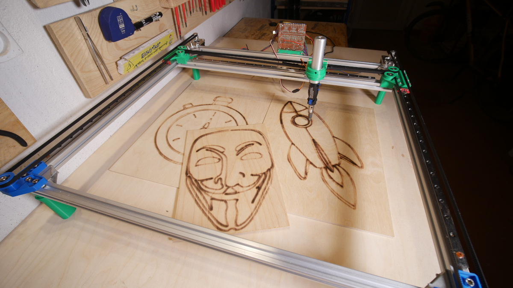

# Pico Plotter

3D printed Raspberry Pi Pico H-Bot plotter programmed in MicroPython capable of drawing on paper and burning wood with versatip.

## Description

Main purpose of this project was to practice Python programing, design something cool and understand basics of how CNC machines, Gcode senders etc. works. This project is probably a great starting point to learn about basics of any CNC machine, as it is very simple and code is very minimal. 3D printed parts are optimized for support less printing (most of them but not all) and can be printed out of PLA. 
## Parts
#### Electronics
| Name                  | Amount | Link 1                                           | Link 2                                           | Link 3                                             |
| --------------------- | ------ | ------------------------------------------------ | ------------------------------------------------ | -------------------------------------------------- |
| Motors                | 2      | [https://bit.ly/3jrCJqY](https://bit.ly/3jrCJqY) | [https://bit.ly/3w9vsim](https://bit.ly/3w9vsim) | [https://amzn.to/3jlCU7o](https://amzn.to/3jlCU7o) |
| Stepper drivers       | 2      | [https://bit.ly/3608XSl](https://bit.ly/3608XSl) | [https://bit.ly/3Abaz9P](https://bit.ly/3Abaz9P) | [https://amzn.to/3yjyXV9](https://amzn.to/3yjyXV9) |
| Power supply          | 1      | [https://bit.ly/3qzeEjz](https://bit.ly/3qzeEjz) | [https://bit.ly/3qzJbxF](https://bit.ly/3qzJbxF) | [https://amzn.to/2T9NVOx](https://amzn.to/2T9NVOx) |
| Raspberry Pi Pico     | 1      | [https://bit.ly/2US6Spl](https://bit.ly/2US6Spl) | [https://bit.ly/3Aegafp](https://bit.ly/3Aegafp) | [https://amzn.to/2Tjz9Vd](https://amzn.to/2Tjz9Vd) |
| USB to UART converter | 1      | [https://bit.ly/3vZQIqF](https://bit.ly/3vZQIqF) | [https://bit.ly/36488Il](https://bit.ly/36488Il) | [https://amzn.to/3dsafcT](https://amzn.to/3dsafcT) |
| Micro servo           | 1      | [https://bit.ly/3A8MjoF](https://bit.ly/3A8MjoF) | [https://bit.ly/3jrOihS](https://bit.ly/3jrOihS) | [https://amzn.to/367zPQh](https://amzn.to/367zPQh) |
| Small components      | \-     |                                                  |                                                  |
#### Mechanics
| Name                         | Amount | Link 1                                           | Link 2                                           | Link 3                                             |
| ---------------------------- | ------ | ------------------------------------------------ | ------------------------------------------------ | -------------------------------------------------- |
| Aluminium profile 2020 600mm | 5      | [https://bit.ly/2UF2auT](https://bit.ly/2UF2auT) | [https://bit.ly/3hjPS2F](https://bit.ly/3hjPS2F) | [https://amzn.to/2UcRjs5](https://amzn.to/2UcRjs5) |
| MGN12 Linear rail 500mm      | 3      | [https://bit.ly/3qwWoHM](https://bit.ly/3qwWoHM) | [https://bit.ly/3jvdd4f](https://bit.ly/3jvdd4f) | [https://amzn.to/3Adcs5K](https://amzn.to/3Adcs5K) |
| MGN12H linear block          | 5      | [https://bit.ly/3qyKxsE](https://bit.ly/3qyKxsE) | [https://bit.ly/3AkVN0r](https://bit.ly/3AkVN0r) | [https://amzn.to/3h266yv](https://amzn.to/3h266yv) |
| GT2 Pulley                   | 2      | [https://bit.ly/3y7doGW](https://bit.ly/3y7doGW) | [https://bit.ly/3AbJDXp](https://bit.ly/3AbJDXp) | [https://amzn.to/3h2xc8I](https://amzn.to/3h2xc8I) |
| GT2 Belt                     | 5m     | [https://bit.ly/3h44CUH](https://bit.ly/3h44CUH) | [https://bit.ly/2U5sbDr](https://bit.ly/2U5sbDr) | [https://amzn.to/3x8Wgk0](https://amzn.to/3x8Wgk0) |
| 625ZZ Bearing                | 6      | [https://bit.ly/2USf3Sz](https://bit.ly/2USf3Sz) | [https://bit.ly/2TbLKKo](https://bit.ly/2TbLKKo) | [https://amzn.to/3vZVZyt](https://amzn.to/3vZVZyt) |
| Corner connectors            | 4      | [https://bit.ly/3h1PA1G](https://bit.ly/3h1PA1G) | [https://bit.ly/3qLDTj3](https://bit.ly/3qLDTj3) | [https://amzn.to/2Ua83Af](https://amzn.to/2Ua83Af) |
| Screws, T nuts etc.          |        |                                                  |                                                  |
#### Tools
| Name               | Link 1                                                         | Link 2                                                             | Link 3                                             |
| ------------------ | -------------------------------------------------------------- | ------------------------------------------------------------------ | -------------------------------------------------- |
| 3D printer         | [https://bit.ly/3qxoAu7](https://bit.ly/3qxoAu7)               | [https://bit.ly/3xZZaHU](https://bit.ly/3xZZaHU)                   | [https://amzn.to/3y25gHV](https://amzn.to/3y25gHV) |
| CNC Machine        | [https://indystry.cc/indymill/](https://indystry.cc/indymill/) | [https://indystry.cc/dremel-cnc/](https://indystry.cc/dremel-cnc/) |                                                    |
| Gas soldering iron | [https://amzn.to/3jEaGoH](https://amzn.to/3jEaGoH)             | [https://bit.ly/3dqgHBm](https://bit.ly/3dqgHBm)                   |
## Getting Started
You don't need any special libraries or additional files, assuming you have Python installed you have everything you need.
In order to upload script to Raspberry Pi Pico I used [Thonny](https://thonny.org/)

### Executing program
Before executing the Gcode sender change port of your raspberry pi pico and also path to the file that you want to print
To execute Gcode sender script simply change directory to where the file is located and type in the terminal:
```
python GcodeSender.py
```

## Help

If you need help, see the problem or want to contribute open an issue.

## Author
[Nikodem Bartnik](https://nikodembartnik.pl/)


## License

This project is licensed under the MIT license.